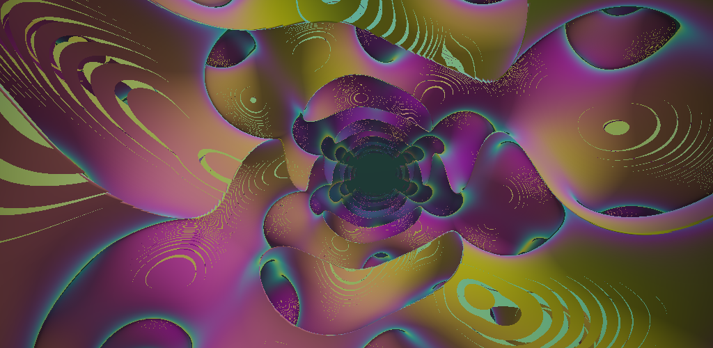
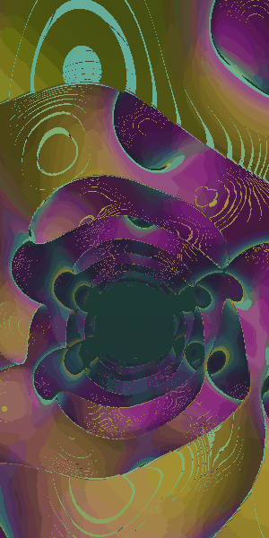
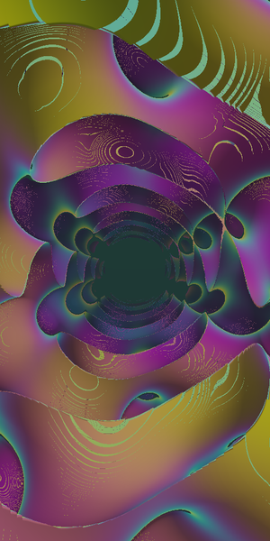
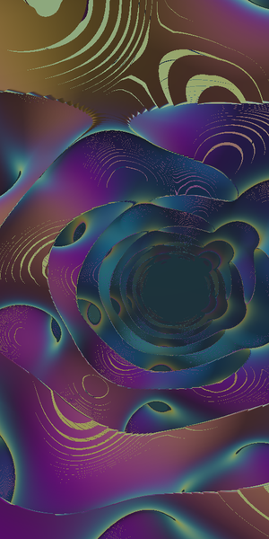
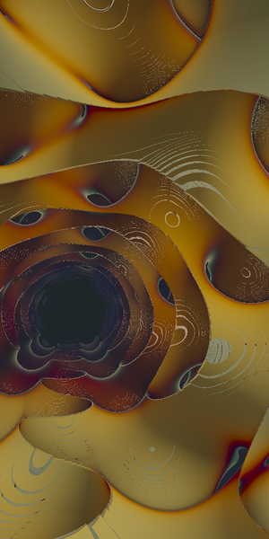
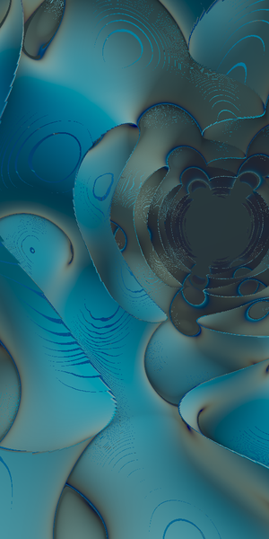

<div align="center">

# Gyroid · Infinite Lattice

**A math‑driven Android live wallpaper** — a single‑pass, ray‑marched [gyroid](https://en.wikipedia.org/wiki/Gyroid) minimal surface you fly through forever, steered in real 3D by tilting your phone.





<sub><i>Live flythrough with tilt sway — rendered from the actual shader.</i></sub>

   

</div>

## What it is

The wallpaper sphere‑traces a triply‑periodic gyroid surface in a fragment shader and carves an open tube along the camera's flight path, so you're always gliding down a luminous, iridescent tunnel of interwoven sheets. There is **no geometry and no textures** — every pixel is pure math evaluated on the GPU.

Tilting the phone is read from the **game rotation vector** sensor and drives the camera direction, so the lattice genuinely parallaxes: near struts slide past far ones and new tunnels open up as you lean the device. It's a real 3D camera move, not a 2D layer slide.

## Features

- 🌀 **Ray‑marched gyroid SDF** — `dot(sin(p), cos(p.yzx))`, sphere‑traced with conservative stepping, 4‑tap tetrahedron normals and step‑count ambient occlusion.
- 📱 **Tilt parallax** — `TYPE_GAME_ROTATION_VECTOR` (gravity/accelerometer fallback), baseline‑relative, EMA‑smoothed, registered only while visible.
- 🎨 **Five palettes** — Iridescent oil‑slick, Aurora, Magma, Cyan Neon, Monochrome (Inigo Quilez cosine gradients).
- ⚙️ **Live settings** — palette, animation speed, lattice thickness, tilt intensity, render quality and frame‑rate cap, all applied without restarting the wallpaper.
- 🔋 **Battery‑aware** — OpenGL ES 3.0 on a dedicated EGL14 render thread that *parks* (zero GPU, zero CPU, sensor unregistered) the moment the wallpaper isn't visible; renders at a fraction of native resolution and caps the frame rate.

## Settings

Open from the wallpaper picker's **Settings**, or from the app's launcher screen.

| Setting | Effect |
|---|---|
| **Color palette** | Iridescent / Aurora / Magma / Cyan Neon / Monochrome |
| **Lattice thickness** | Thin filigree ↔ chunky tubes |
| **Animation speed** | 0–200% of the fly‑through rate |
| **Tilt parallax intensity** | 0 disables motion sensing; up to 150% |
| **Render quality** | Battery saver / Balanced / High (render scale + ray‑step budget) |
| **Frame‑rate cap** | 30 or 60 fps |

## Tech

| | |
|---|---|
| Language | Kotlin |
| Rendering | OpenGL ES 3.0, hand‑rolled EGL14 context bound to the wallpaper `SurfaceHolder`, attribute‑less full‑screen triangle (`gl_VertexID`) |
| Target | `compileSdk` / `targetSdk` 36 (Android 16), `minSdk` 26 |
| Toolchain | AGP 8.13.2 · Gradle 8.14.3 · Kotlin 2.2.20 · JDK 21 |
| Native code | none (no NDK; the 16 KB page‑size requirement does not apply) |

## Build

Requires JDK 17+ and the Android SDK (platform 36, build‑tools 36). With `ANDROID_HOME`/`local.properties` pointing at your SDK:

```bash
./gradlew assembleDebug      # -> app/build/outputs/apk/debug/app-debug.apk
./gradlew assembleRelease    # -> app/build/outputs/apk/release/app-release.apk
```

Install and apply:

```bash
adb install -r app/build/outputs/apk/release/app-release.apk
# then open the "Gyroid" app and tap "Set as wallpaper",
# or: Settings → Wallpaper → Live wallpapers → Gyroid
```

Application id: `xyz.yoav.gyroid` (debug builds use the `.debug` suffix so they can be installed side‑by‑side).

### Device notes

Some manufacturers (OnePlus / Oppo / Realme on ColorOS/OxygenOS, Xiaomi MIUI, etc.) ship aggressive battery managers that **block sideloaded apps from launching in the background** — including live‑wallpaper services bound by the system. If the wallpaper previews correctly but silently reverts when you apply it, enable **auto‑launch / background activity** for Gyroid:

> **Settings → Apps → Gyroid → Battery usage → Allow background activity / "Unrestricted"**, and enable any **"Allow auto‑launch"** toggle for the app.

This is a device policy, not an app bug — see [dontkillmyapp.com](https://dontkillmyapp.com).

## Releases & CI

GitHub Actions ([`.github/workflows/android.yml`](.github/workflows/android.yml)):

- **Every push / PR** → builds and uploads a debug APK artifact.
- **Push a `v*` tag** → builds a release APK and attaches it to a **GitHub Release**.

```bash
git tag v1.0.0 && git push origin v1.0.0
```

Release signing is optional. Without secrets the release APK is debug‑signed (still installable for testing). To sign with your own key, add these repository secrets and the workflow will use them automatically:

`KEYSTORE_BASE64` (base64 of your `.jks`), `SIGNING_STORE_PASSWORD`, `SIGNING_KEY_ALIAS`, `SIGNING_KEY_PASSWORD`.

```bash
openssl base64 -A < release.jks   # value for KEYSTORE_BASE64
```

## License

MIT — see [`LICENSE`](LICENSE).
